```table-of-contents
```

# Intro
- Previous modules:
	- **System Design** - High-level arch (Components, services, modules)
	- **OOP** - class-level structure, relationships (aggregation, inheritance, etc.)
	- **SOLID Principles** - Best practices for writing individual classes and interfaces
		- **S.** ingle Responsibility - *1 responsibility; 1 reason for the class to change*
		- **O.** pen-Closed - Classes are *OPEN for extension*, *CLOSED for change*
		- **L.** iskov Dubstitution - *All adapters implement the same interface and can be used interchangeably.* 
			- Not have any errors when you exclude a subsystem via inheritance
		- **I.** nterface Segregation - *Classes should not be forced to implement a method that does not apply to its behavior* , Ex: interface implemented by 2 classes, but does not apply to those 2 classes; 
			- Shape interface has getVolume() implemented by Square and Sphere, but Square doesn't have volume
		- **D.** ependency Inversion - *Classes should depend on abstractions, not concretions*
			- Ex: one class conditionally invokes class1 and class2
				- class1 and class2 should not be invoked via concrete class, but instead interface
			- Code is stronger. Violating this also violates open-closed principle
	- **Design Principles** -
		- *Cohesion:*
			- **High** - *1 responsibility only*, View doesn't access Model, speaks to Database Access Layer, which accesses Model
			- **Medium** - Ex: 2 components coupled but are logically related
			- **Low** - More than 1 responsibility with components not logically related
				- access to more than 1 layer

	- **Open-Closed Principle and Dependency-Inversion**
		- Help with:
			- *Protection from variations*


- This Module:
	- **Design Patterns**

# Design Patterns
- **A design pattern is a recurring solution to a standard problem, in a context**
- You will find structure, but not the solution
- Not complex arch design, Design Pattern is just a description:
	- "Descriptions of communicating objects"
- "I want customer to have one shopping cart, and accesses the same cart no matter what or where they are"
	- **Singleton Design Pattern**
- "I use external API to get movies. In future I might change API, and I want my code to adapt to this."
	- **Adapter Design Pattern**
- "I want to control access to an object, or add behavior before/after its operations, without modifying the object itself."
    - **Proxy Design Pattern**
    - - **"lazy creation"**, **access control**, **remote communication**
- "I need to create objects, but the exact type to create depends on certain conditions, and I want to defer object creation to subclasses."
    - **Factory Design Pattern**
- "I need to ensure that only one instance of a specific class exists throughout my application, for example, a central configuration manager."
    - **Singleton**
    - **"lazy creation"**
- "I need to construct a complex object step-by-step, where the object can have many optional parts, and I want to produce different types and representations of the object using the same construction process."
    - **Builder Design**
- "I need to create families of related objects (e.g., UI elements for a specific theme or operating system) without specifying their concrete classes."  
    - **Abstract Factory**


## Practical Use Case
- Imagine you're developing a system that integrates w/ multiple 3rd-party services. Each service has unique API, and you want to standardize the way your system interacts w/ them.
```
void ProcessPayment(double amount) {
	PaymentProcessor P = getPaymentType();
	switch(P) {
		case PAYPAL {
			PayPalAPI.sendPayment(amount);
			break;
		}
		case STRIPE {
			PayPalAPI.sendPayment(amount);
			break;
		}
		case SQUARE {
			PayPalAPI.sendPayment(amount);
			break;
		}
	}
}
```
- Problem:
    - **Violates Open-Closed Principle**: Every time a new payment service is added (e.g., Apple Pay), you have to `open` and modify the `ProcessPayment` method and its `switch` statement.
    - **Violates Dependency Inversion Principle**: The `ProcessPayment` method depends on concrete implementation details (`PayPalAPI`, `StripeAPI`, `SquareAPI`) rather than an abstraction.
- Solution:
    - Need ADAPTER
    - adapter can take multiple input plug types and still result in same output - charge device/ power device
        - allows incompatible interfaces to work together
        - wraps existing class w/ a new interface that system expects

### Solution:
I Payment Processor Class w/ processPayment(amount), is implemented by:
- PayPalAdapter class
	- has own processPayment(amount) function
- StripeAdapter class
	- has own processPayment(amount) function
- SquareAdapter class
	- has own processPayment(amount) function

	- *This approach allows new payment methods to be added by creating new adapter classes without modifying the `ProcessPayment` logic, thus adhering to the Open-Closed Principle.*

## Design Patterns Elements
- Design patterns have 4 basic elements:
	- Pattern name:
	- Problem:
	- Solution:
	- Consequences:

## Benefits of Design Patterns
- Patterns explicitly capture expert knowledge and design tradeoffs and make it more widely available
- Design patterns enable large-scale reuse of software architectures and also help document systems
- Pattern names form a common vocabulary
	- Using terms like **Observer** or **Singleton** creates instant understanding among developers
	- *Ex: "Factory" -> SuperClass, inherited by xyz, like if you want to use Factory to create "Tickets: Child, Adult, Senior"*


# Three Types of Patterns:
- **Creational Patterns**
	- need to create a bunch of objects, complex objects
- **Structural Patterns**
    - composition of classes and objects, forming larger structures while keeping them flexible and efficient
    - describes how to assemble objects and classes into larger, more complex structures.
    - How to decouple classes
- **Behavioral Patterns**
    - These patterns are concerned w/ algorithms and the assignment of responsibilities b/w objects. They describe how objects communicate and interact.
# Creational Patterns
- need to create a bunch of objects, complex, expensive objects
	- constructor may have like 40 attributes, which becomes a complex creational problem
		- Use ->
	- Want to create a lot of things but won't know the things until runtime
		- Use -> Factory Design Pattern
## Singleton
- Intent:
	- Ensure class has only one instance, and provide a global point of access to it
- Motivation:
	- Don't want to create multiple objects that are complex or expensive
- Ex: "Want to create a single large object, that you don't want to create more than once"
	- Sorta like having static variable, but this solution of single class is better
- Ex: 
	- there can be many printers in a system, there should be only one printer spooler
	- there should be only one object with a large state *internal data*
	- creating lots of objects can take a lot of time
	- extra objects take up memory
	- it is cumbersome to deal w/ diff objects "floating" around if they're essentially the same
- Ex:
	- Some systems prevent you from creating +20 connections to database in pool

### Database Connection Singleton Pattern
- Application -> DatabaseConnection (Singleton Instance) -> Database Server

| Singleton                                        |
| ------------------------------------------------ |
| <u>-instance: Singleton</u>                      |
| -Singleton()<br><u>+getInstance(): Singleton</u> |

| DBConnectionSingleton                                                    |
| ------------------------------------------------------------------------ |
| <u>-instance: DBConnectionSingleton</u>                                  |
| -DBConnectionSingleton()<br><u>+getInstance(): DBConnectionSingleton</u> |
- need static instance and static getInstance so you can call it anywhere in code w/o creating object 
	- *(e.g. SignalBus.getInstance())*
### Interaction Between Objects
### Adapting Singleton Pattern to Multi-Threading Environment
- have to have singleton as a Volatile Instance / Volatile Singleton
- And would have to improve code to have singleton stored locally to improve performance

### Diagram:
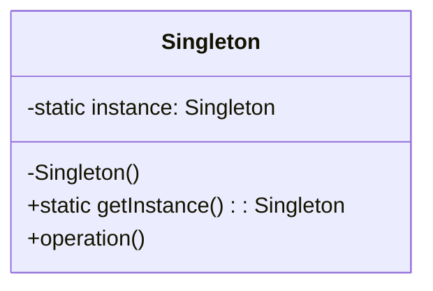
## Factory Method
- Used to replace class constructors, abstracting the process of object generation so that the type of the object instantiated can be determined at run-time
- Separating the object construction from the client code
- " I have 20,000 levels for a game, do I need 20,000 classes? "
	- NO. use one constructor, and based on runtime, then you change the initialization 

- Related to Abstract Factory
- Product is an interface
- ConcreteProduct instances can be created
- FactoryMethod() of the Creator interface returns a Product object, but which ConcreteProduct is actually created (the actual constructor call) is hidden in the ConcreteCreator

### Ex 1:
```
/* Two ways to create Object */

// This directly instantiates a concrete class.
1. User user = new SilverUser();

// This uses a factory method.
1. User user = UserFactory.create(Silver, name)
```

1. what is wrong with this:
	1. 1. violates:
        1. **Open-Closed Principle** - If you add a new user type (e.g., `GoldUser`), you have to `open` and modify all client code that directly instantiates `User` objects.
        2. **Dependency Inversion Principle** - The client code directly depends on the concrete `SilverUser` class, rather than an abstract `User` interface or class.
            1. you won't know the specific item until runtime


```
Client -> Creator class
Creator class (abstract):
	+ CreateUser()
UserCreator (concrete) extends Creator class:
	+ CreateUser()
```

### Factory Method (Idiom): Factory Item
- Different from Factory Method
	- You refactor weak code into one instance instead of many
	- Solves Dependency Inversion violation

- Ex:
	- RegularUser, GoldUser, PlatinumUser
```
Client code:
if (cond1)
	User user = new RegularUser()
elif (cond2)
	User user = ...
...

```
- Problem: Dependency Inversion violation

- Client invokes the proper constructor

- You refactor that weak code into one Creator interface and UserCreator concrete class

### Factory Method Pattern: Structure
![[Drawing 2025-10-21 10.43.23.excalidraw]]

- Ex: Restaurant Class
	- BeefBurger class or VeggieBurger class
	- multiple if else statements
	- violates Open-Closed Principle
	- violates Single Responsibility
		- Restaurant should just be a class defining restaurant managing actions,
			- not deciding and creating specific types of burgers
		- Restaurant class would need to change for 2 distinct reasons
	- instead -> separate Burger Creation logic into "Burger Factory" or something similar
		- abstract BurgerFactory, concrete BeefBurger Factory, concrete VeggieBurgerFactory,

### Ex 2:
```java
public class BurgerFactoryRegistry {
	private static final Map<String, BurgerFactory> registry = new HashMap<>();
	
	// define private constructor since all methods are static.
	private BurgerFactoryRegistry() {}
	public static void registerFactory(String type, BurgerFactory factory) {
		registry.put(type.toLowerCase());
	}
}

public class Main {
	public static void main(String[] args) }
		BurgerFactoryRegistry.registerFactory("beef", new BeefBurgerFactory());
		BurgerFactoryRegistry.registerFactory("veggie", new BeefBurgerFactory());
		
		Scanner scanner = new Scanner(System.in);
		System.out.println("Choose your burger: beef or veggie");
		String choice
}

-> Violates Open-Closed : Have to open client code to add, e.g., "chicken" burger
```

#### Moving Registration Out
```java
// Example of how registration might be externalized or automated.
// This allows new factories to be added without modifying the Main class.
public class AppInitializer {
    public static void initializeFactories() {
        // This could be loaded from a config file, scanned from a package,
        // or done via dependency injection.
        BurgerFactoryRegistry.registerFactory("beef", new BeefBurgerFactory());
        BurgerFactoryRegistry.registerFactory("veggie", new VeggieBurgerFactory());
        // BurgerFactoryRegistry.registerFactory("chicken", new ChickenBurgerFactory()); // New burger, no change to Main!
    }
}
```

#### Final OCP-Compliant Main Method
```java
public class Main {
	public static void main(String[] args) {
        AppInitializer.initializeFactories(); // Register factories once at startup

        Scanner scanner = new Scanner(System.in);
		System.out.println("Choose your burger: beef or veggie (or chicken if added)");
		String choice = scanner.nextLine();

        BurgerFactory factory = BurgerFactoryRegistry.getFactory(choice);
        if (factory != null) {
            Burger burger = factory.createBurger();
            System.out.println("Created: " + burger.getName());
        } else {
            System.out.println("Invalid choice.");
        }
        scanner.close();
    }
}
```
### Cons
- Class explosion
- If you need different types of objects/items to create
	- Prototyping is good for cloning new objects
### Context Used
- Don't know what item you create at runtime
### Can the code break if an expansion is required
- What if we open another restaurant that prepares the same recipes but in an Italian way?
	- No, if implemented correctly (e.g., with externalized registration as shown in the OCP-compliant example), the code should not "break." The client code (like `Main`) will remain unchanged when new burger types are added. Only new `BurgerFactory` and `Burger` classes need to be created and registered, adhering to the Open-Closed Principle.
	- What if we open another restaurant that prepares the same recipes but in an Italian way?
	    - This scenario suggests using an **Abstract Factory** pattern, where you'd have factories for different "styles" (e.g., `ItalianRestaurantFactory`, `AmericanRestaurantFactory`), each capable of producing a family of related products (e.g., `ItalianBurger`, `ItalianFries`).

### Diagram:
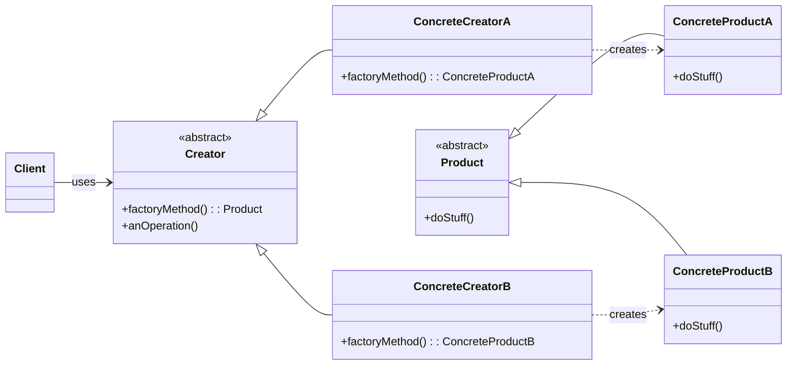

- _Explanation_: A `Creator` declares the factory method, which returns an object of type `Product`. `ConcreteCreator` subclasses implement the factory method to return specific `ConcreteProduct` instances.


## Abstract Factory
- MacOS vs Windows
- Client requests object, the Abstract Factory gives you MacOS/Windows object
## Builder Design
### Diagram:
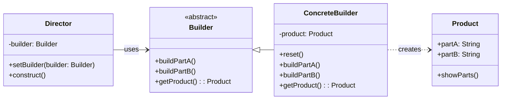

- _Explanation_: The `Director` constructs a `Product` using a `Builder` interface. `ConcreteBuilder` implements the building steps and returns the constructed `Product`.
## Abstract Factory
### Diagram:
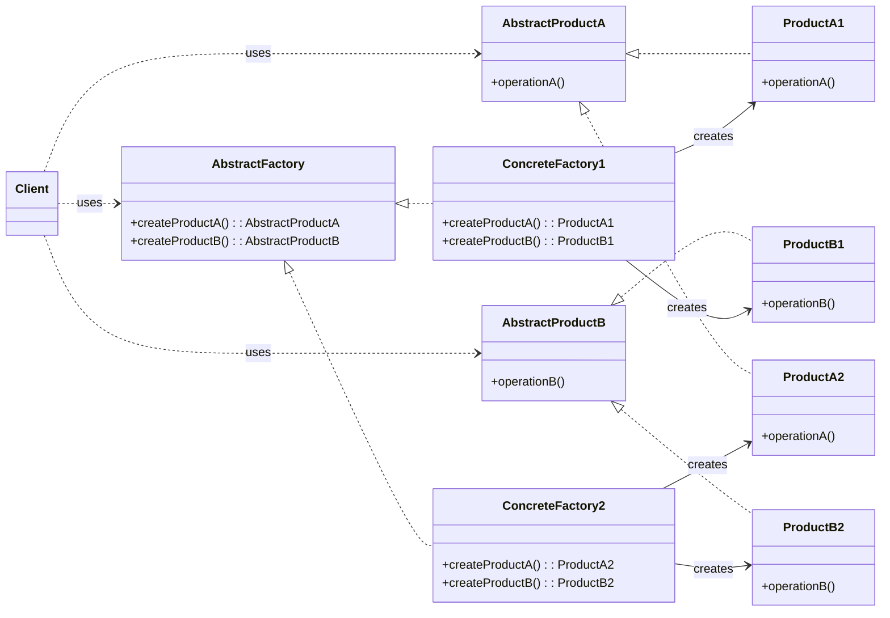


## Builder

## Bridge
- for backwards compatibility
### Diagram:
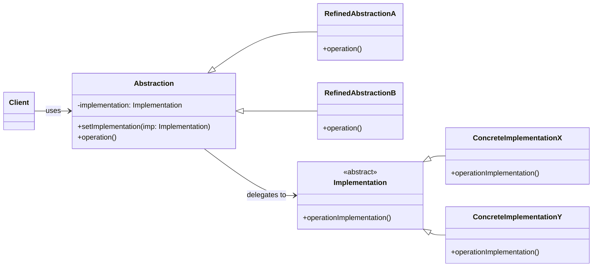

# Structural Patterns
## Proxy
- "Proxy" - **substitute, acts as convenient surrogate/placeholder for another object**
	- Ex: "Out of Office Automatic Reply Bot" is a proxy for Teacher/Staff member
	- Ex: Firewall that connects to url - 
		- firewall gets the request, and directs you actual website or will not allow your ip address

- *Putting some object in the middle of two others, to decouple the objects*

- Examples:
	- Restricted websites for some users based on privileges

### Diagram:
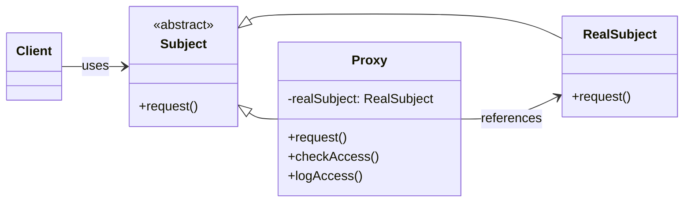

### Virtual Proxy: 
- Represents a large object
- is used when:
	- the real object is expensive to create or retrieve (e.g., remote data, large files).
	- We want to delay the creation/fetching of that object until it's needed.
	- We may cache or batch-load content to improve performance.
- **Goal:** Performance
- **Ex**: Load Chat History (Lazy fetching)
	- Proxy can just get 10 things, until user requests more, then it contacts actual model for more

#### Diagram:
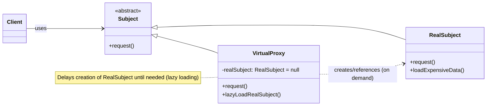

### Protected Proxy:
- Protects access to original object
- Proxy is put in the middle
- **Goal:**
#### Diagram:
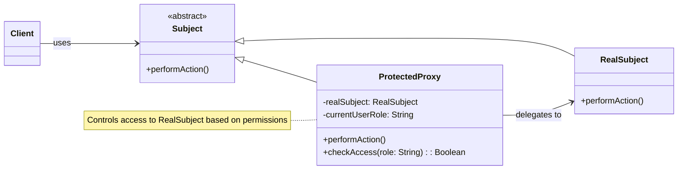

### Remote Proxy:
- 
- **Goal:**
#### Diagram:
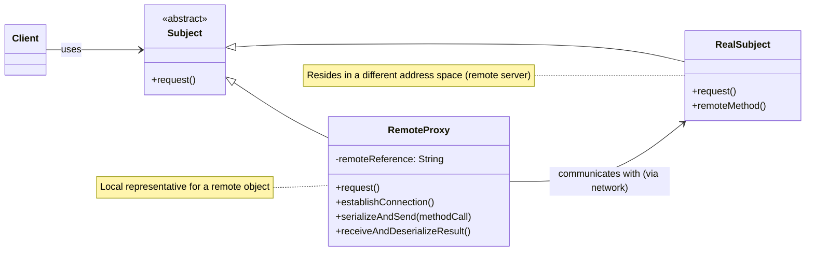


## Adapter
- The adapter pattern lets classes work together that could not otherwise because of incompatible interfaces
	- "Convert the interface of a class into another interface expected by a client class."
	- Used to provide new interfaces to existing legacy components (Interface engineering, reengineering)
- Object adapter:
	- Uses single inheritance and delegation otherwise because of incompatible interfaces
- Intent:
	- Convert the interface of a class into another interface clients expect
	- Adapter lets classes work together, that could not otherwise because of incompatible interfaces
- Structure
	- ![[Drawing 2025-10-23 10.21.22.excalidraw]]
### Diagram:
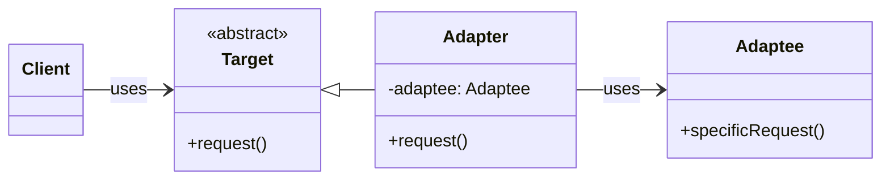

## Facade
- Provides a unified interface to a set of objects in a subsystem
- A facade defines a higher-level interface that makes the subsystem easier to use (i.e. it abstracts out the "gory details")
- Facades allow us to provides a closed architecture
	- "Less spaghetti code"

### When to Use Facade?
- When you want to provide a simpler interface to a complex subsystem.
- When you want to decouple the client from the implementation details of a subsystem.
- When you want to layer your system, introducing a point of entry for each layer or module.

### Diagram:
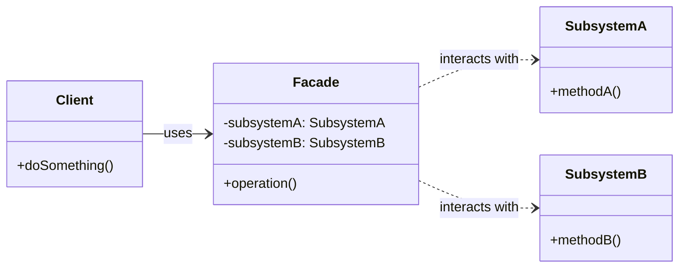
- **Scenario:** Imagine you have a complex home theater system with multiple devices (DVD player, amplifier, projector, lights). To watch a movie, you need to turn on several devices, set their inputs, adjust volume, and dim the lights. Without a Facade, you'd have to interact with each device individually.

- **Problem:** The client code (you, the user, or an application) has to manage many interactions with various subsystem components to perform a simple task like "watch a movie." This makes the client code complex and tightly coupled to the subsystem's internal workings.

- **Solution: HomeTheaterFacade**
```java
// Subsystem Components (complex to use individually)

class DVDPlayer {
    public void on() { System.out.println("DVD Player On"); }
    public void play(String movie) { System.out.println("Playing movie: " + movie); }
    public void stop() { System.out.println("DVD Player Stop"); }
    public void off() { System.out.println("DVD Player Off"); }
}

class Amplifier {
    public void on() { System.out.println("Amplifier On"); }
    public void setDvd(DVDPlayer dvd) { System.out.println("Amplifier setting DVD input"); }
    public void setVolume(int volume) { System.out.println("Amplifier volume set to " + volume); }
    public void off() { System.out.println("Amplifier Off"); }
}

class Projector {
    public void on() { System.out.println("Projector On"); }
    public void wideScreenMode() { System.out.println("Projector in widescreen mode"); }
    public void off() { System.out.println("Projector Off"); }
}

class Lights {
    public void dim(int level) { System.out.println("Lights dimming to " + level + "%"); }
    public void on() { System.out.println("Lights On"); }
}

// Facade

class HomeTheaterFacade {
    DVDPlayer dvd;
    Amplifier amp;
    Projector projector;
    Lights lights;

    public HomeTheaterFacade(DVDPlayer dvd, Amplifier amp, Projector projector, Lights lights) {
        this.dvd = dvd;
        this.amp = amp;
        this.projector = projector;
        this.lights = lights;
    }

    public void watchMovie(String movie) {
        System.out.println("\nGet ready to watch a movie...");
        lights.dim(10);
        projector.on();
        projector.wideScreenMode();
        amp.on();
        amp.setDvd(dvd);
        amp.setVolume(5);
        dvd.on();
        dvd.play(movie);
    }

    public void endMovie() {
        System.out.println("\nShutting down movie theater...");
        dvd.stop();
        dvd.off();
        amp.off();
        projector.off();
        lights.on();
    }
}

// Client Usage

public class Client {
    public static void main(String[] args) {
        // Instantiate the subsystem components
        DVDPlayer dvd = new DVDPlayer();
        Amplifier amp = new Amplifier();
        Projector projector = new Projector();
        Lights lights = new Lights();

        // Create the Facade, passing it the subsystem components
        HomeTheaterFacade homeTheater = new HomeTheaterFacade(dvd, amp, projector, lights);

        // Client interacts with the Facade for complex tasks
        homeTheater.watchMovie("The Matrix");
        homeTheater.endMovie();
    }
}
```

- **Explanation:**
	- **Subsystem:** `DVDPlayer`, `Amplifier`, `Projector`, `Lights` are the individual, relatively complex components.
	- **Facade:** `HomeTheaterFacade` acts as a simplified entry point. It contains references to all necessary subsystem objects.
	- **Client:** The `Client` (in the `main` method) no longer needs to know how to interact with each individual device. It simply calls `homeTheater.watchMovie("The Matrix")` or `homeTheater.endMovie()`, and the Facade handles all the underlying complex interactions.
## Decorator
- user interface, the user pages
- to turn one form into another form
![[Drawing 2025-10-28 10.02.31.excalidraw]]

- choose between factory or decorator for creating ticket-types

- examples of decorators (not required):
	- add a snack or recliner to booking ticket

### When to use Decorator?
- When you need to add responsibilities to individual objects dynamically and transparently, without affecting other objects.
- When it's impractical or impossible to extend an object's functionality using inheritance (e.g., to avoid a "class explosion" or if the class is `final`).
- When you want to avoid altering existing code while adding new features.

## Diagram:
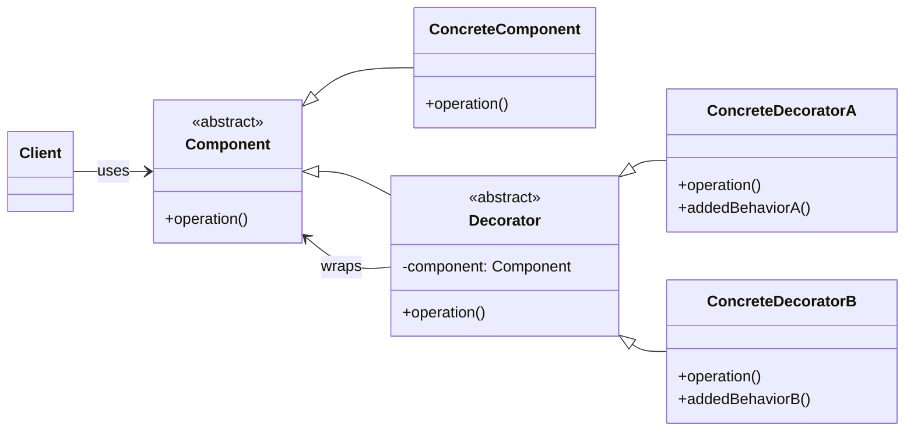


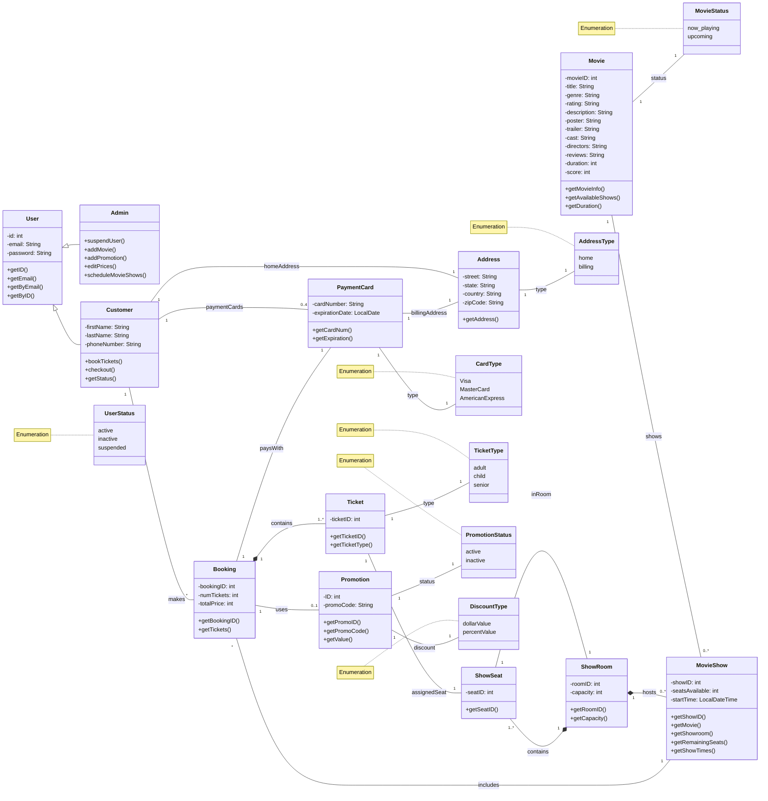
