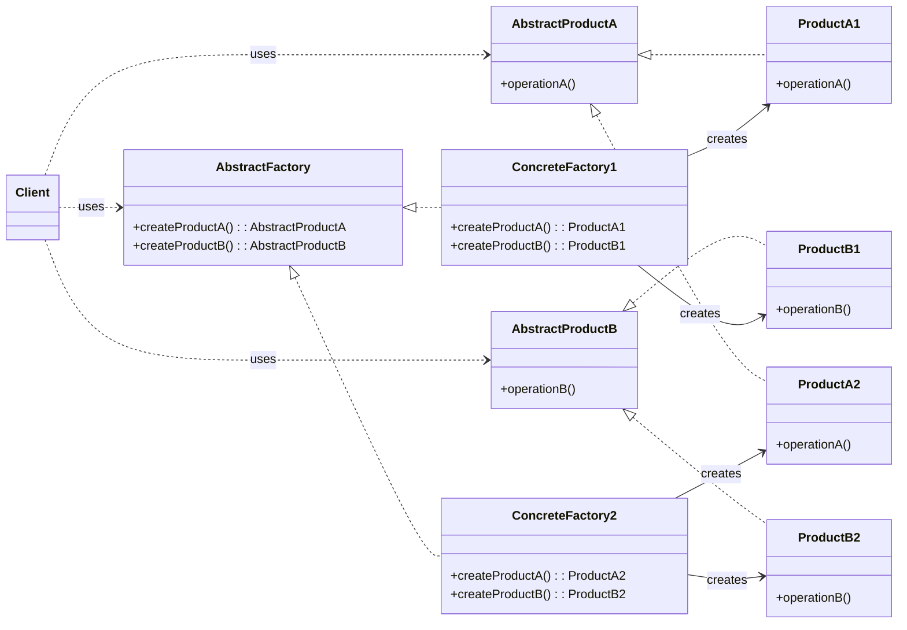

```table-of-contents
```
## Intent
- Provide an interface for creating families of related or dependent objects w/o specifying their concrete classes
- The Abstract Factory pattern is very similar to the Factory Method pattern.
- One difference b/w the 2 is that w/ the Abstract Factory pattern, a class delegates the responsibilities

### Ex: Portability
- MacOS vs Windows
- Client requests object, the Abstract Factory gives you MacOs/Windows object

- The abstract factory is the GUIFactory
- GUIFactory is just a Facade

```
public Application(GUIFactory factory)
{
	private Button button;
	private Checkbox checkbox;
	button = factory.createButton();
	checkbox = factory.createCheckbox();
	
	public void paint() {
		button.paint();
		checkbox.paint();
	}
}
```

```
public class Demo {
/** App picks factory type and creates it in run time (usually at initialization stage), depending on configuration or environment variables

	private static Application configureApplication() {
		Application app;
		GUIFactory factory;
		String osName = System.getProperty("os.name").toLowerCase();
		if (osName.contains("mac")) {
			factory = new MacOSFactory();
		} else {
			factory = new WindowsFactory();
		}
	}
	
	public static void main(String[] args) {
		Application app = configureApplication();
		app.paint(); // Simulate using the application
	}
}
```
## Abstract Factory Pattern: UML Diagram
- Structure:



