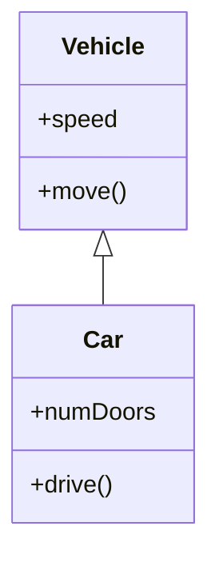

# Software Testing Fundamentals
```table-of-contents
```

## 1. Testing Heuristics
*   **Definition:** 
	* Experience-based rules of thumb or guiding principles that help testers make informed decisions, prioritize, and design tests. *They are not strict rules but valuable insights.*
*   **Example:** 
	* "The more we test, the more bugs we find."
		* (Implies thoroughness often uncovers more issues).
	* "Testing is never complete." 
		* (Acknowledges that complete bug elimination is impossible).

## 2. Black Box vs. White Box Testing

*   **Black Box Testing (Functional Testing):**
    *   **Focus:** Tests the software's *external behavior and functionality* against requirements, *without* knowledge of its internal code or structure.
    *   **Analogy:** Testing a car by driving it and checking if it accelerates, brakes, turns, etc., without looking under the hood.
    *   **Example:** Verifying if a login screen accepts valid credentials and rejects invalid ones.
	    * 

*   **White Box Testing (Structural Testing):**
    *   **Focus:** Tests the internal logic, structure, and code paths of the software, *with* knowledge of the source code.
    *   **Analogy:** A mechanic examining the car's engine, wiring, and internal components to ensure they function correctly.
    *   **Example:** Ensuring every `if-else` branch in a calculation function is executed at least once.
	    * try exceeding test cases, pushing limits of constraints, out of bound exceptions, etc.
	* **Techniques:**
		 - *Conditions coverage*
			 - 
		 - *Code coverage*
			 - 
		 - *Branch coverage*
			 - 
		 - *Path coverage*
			 - Tests Conditions, Code, and Branch coverage
			 - Best to do at Unit Testing level
			 - Looking at every path is known as **path coverage** (very expensive)

## 3. Levels of Testing

Testing is typically performed at different levels, progressing from individual code units to the complete system.

### A. Unit Testing
*   **Definition:** Tests individual, smallest testable parts of an application (e.g., a function, method, class) in isolation.
*   **Purpose:** To verify that each unit of code performs as expected.
*   **Performer:** Developers.
*   **Example:** Testing a `calculateDiscount(price, percentage)` function to ensure it returns the correct discounted price for various inputs.

### B. Component Testing
*   **Definition:** Tests a larger collection of units that form a logical component or module. These components are often integrated but still tested in isolation from the full system.
*   **Purpose:** To verify the functionality and interaction of related units within a component.
*   **Example:** Testing a "Shopping Cart" component, ensuring items can be added, removed, quantities updated, and the total calculated correctly.

### C. Integration Testing
*   **Definition:** Tests the interfaces and interactions between integrated components or modules.
*   **Purpose:** To detect faults in the interaction between integrated units or components, and ensure they work together as expected.
*   **Approaches:** "Top-down," "Bottom-up," or "Big-bang."
*   **Example:** Testing the interaction between a "Product Catalog" component and a "Shopping Cart" component to ensure products added from the catalog appear correctly in the cart.
	* Test addItemToCart
	* Simple Driver to test createCartItem
* Strategies:
	* 

- Should integrate step by step:
	- Have test cases that frontend and backend are working in correct way
	- then test the 3 components, frontend and backend and database
- In plan driven approaches, you have diff teams working on diff parts, until integration testing phase
	- frontend develops frontend parts
	- backend parts develops backend code
- In Scrum:
	- you integrate whenever

### D. System Testing
*   **Definition:** Tests the entire, fully integrated software system against the specified requirements.
*   **Purpose:** To evaluate the system's compliance with functional and non-functional requirements (e.g., performance, security, usability) in an environment that mimics production.
*   **Performer:** Independent testers or dedicated QA teams.
*   **Example:** Testing an entire e-commerce website to ensure end-to-end functionality, from user registration, browsing, adding to cart, checkout, payment processing, and order confirmation.

### E. Acceptance Testing
- **Definition:** Testing the hwole system by the client/users
- Blackbox could be used and reuse Whitebox testing

- 2 Types: *done by client/users*
	- **Alpha Testing:**
		- testing by Clients
			- *could be on Client's or Developer's site/environment*
		- but <span style="background:#fff88f">developers exist, run test, help running test</span>
	- **Beta Testing:**
		- testing on Client's own environment
		- *you test on your OWN environment* as if <span style="background:#fff88f">devs DO NOT EXIST</span>

### Bottom-Up Testing

### Top-Down Testing


- white box test cases are RAN with black box test cases
	- (document your test cases)
	- (always have you test cases ready)
- typically devs have manual white box test cases ready, and then team uses automated black box test cases
	- both testing types help each other

- we do the most coverage at unit testing since they can do white box testing (path coverage)

Final Demo:
- KNOW YOUR TEST CASES and TEST EVERYTHING during DEMO
	- Booking process
		- use not logged in, checkout, msg: "must login"
		- you know the username and password

- FINAL DEMO:
- always focus on user values first to test:
	- login, logout, registration

- dont spend so long registering


- Which techniques are white box, which techniques are black box:


## TESTING :

Top-Down:
- user interface first, then middle tier, then connection to database
- have to implement stops
- Focus on user interface first

Bottom-Up:
- start w/ components that show output
- testing functionality with checkout
- then see if email sent with correct price and calculations and etc
- need to implement drivers, in order to substitute params
- A better approach:

Sandwich Approach:
- connection of database is ready
- ui is ready
- check middle-tier logic
- every time you want to test some functionality, you test it with user interface and other layers

- however, if we need to ____, we need to use the following testing:
Stress testing / Performance Testing:
- testing system BEYOND its limits
- how system behaves if we exceed the limits

White vs black techniques
definition of testing and how we use it

asking to list the methods and specific class 

ex: :2BWatchDisplay ©mm diagraam)
- look for incoming input messages
	- if sequence look at all input arrows
	- if communication, look at all input messages going into it
- input messages mean we invoke it coming from x class

ex: : Patron (squence diagram)
- what are the input messages?
	- **getPatronInfo() GOING INTO Patron from checkoutHandler**

COnverting
![[Drawing 2025-11-13 09.48.56.excalidraw]]
![[Drawing 2025-11-13 09.50.31.excalidraw]]

What is the signature method of the following:
- ex: 
	- **tn := createNode(x)**
	- Answer: createNode(int x): TreeNode

Given use case description, select correct sequence diagram:
- ex:
	- Use Case Cancel Order Description:
		- given inv was reserved whne order was made, cancel an orde rinvolves that all order items in order must be canceled and their inv quantities must be updated.
	- First Cut Deisng Diagram

- cancel all items in order
- then refund
- update inv quantities
![[Drawing 2025-11-13 09.58.40.excalidraw]]


# Test Review..

<hr>
- solid principles
- arch patterns
	- creational
	- structural

ex:
- Consider an existing game of bridge written in Java. We are interested in integrating this bridge game into ARENA thru GameMove interface. Which design pattern would you use? Draw a UML class diagram relating the ARENA objects w/ the class BirdgeMove, we expect to find int he bridge game
	- ARENA interface
	- Bridge game
![[Drawing 2025-11-13 10.19.16.excalidraw]]
Answer:
- Adapter

ex:
- In web pages tables consist of rows, which in turn consist of cells. The actual width and height of each cell is computed in part on its content
- Using design pattern, describe an object model and an algorithm (solution steps) that would enable a web browser to start displaying a table before the size of all cells is known, possibly redrawing the table as the content of each cell is downloaded.
Answer:
- Proxy Design Pattern. Lazy Loading. The proxy will paint a default table until the actual data is downloaded.
![[Drawing 2025-11-13 10.24.37.excalidraw]]


Pattern Conceptual Questions:

Which allows yout o add newfunctionaloity to an object w/o modifying existing code by using wrapper object that impelemnt same interface and delgates its actions to the original object?
- Decorator

Separate the construction of a ***complex*** object from its representation so that the same construction process can create diff representations
- Builder

Youre designing text editor app processing user input. you have basic Text object that stores raw content. Now, additional features are needed: spell checking, auto correction, syntax highlighting, and markdown rendering. Each feature may be turned on or off independently, and multiple feats may be layered together in diff combinations depending on user preferences.

Q1) Compare:
1. black box and white box
2. alpha and beta testing
3. system testing and acceptance testing

Q2) Which is glassbox technique?
1. Path coverage
2. partitioning
	- black box
		- partition based on input and output
			- test checkout, you need to know the correct input
			- test alternative flows and exceptions

				1. Test case: user not logged in -> system asks to log in
					- login w/ (thai, theguy@gmail.com ), movie=Smurfs, show 12-3pm, 2 adult, 1 senior
				2. Test case: non-logged in user 
					- smurfs, show 12-3, 2 adult, 1 child)
					- Output:
						- system should direct user to the login page
					- login w/ (John, pwd). John does not have stored payment
				3. User has a stored payment card.
					- Test data: ___
				4. User does not have a stored payment card
					- Test data: ___
					- System directs to enter payment

3. test system by pushing beyond max data storage capacity



- hollow triangle arrow from `Car` to `Vehicle` signifies that `Car` inherits from `Vehicle`. `Car` is the subclass, and `Vehicle` is the superclass.