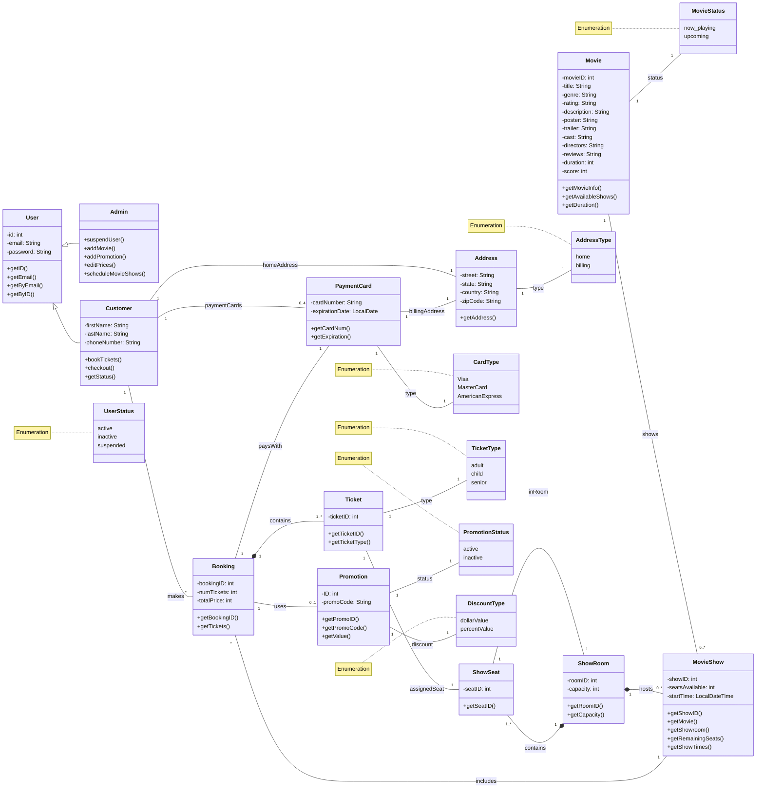

```mermaid
classDiagram
    direction LR

    class User {
        -id: int
        -email: String
        -password: String
        +getID()
        +getEmail()
        +getByEmail()
        +getByID()
    }
    class Admin {
        +suspendUser()
        +addMovie()
        +addPromotion()
        +editPrices()
        +scheduleMovieShows()
    }
    class Customer {
        -firstName: String
        -lastName: String
        -phoneNumber: String
        +bookTickets()
        +checkout()
        +getStatus()
    }
    class Address {
        -street: String
        -state: String
        -country: String
        -zipCode: String
        +getAddress()
    }
    class PaymentCard {
        -cardNumber: String
        -expirationDate: LocalDate
        +getCardNum()
        +getExpiration()
    }
    class Booking {
        -bookingID: int
        -numTickets: int
        -totalPrice: int
        +getBookingID()
        +getTickets()
    }
    class Ticket {
        -ticketID: int
        +getTicketID()
        +getTicketType()
    }
    class Promotion {
        -ID: int
        -promoCode: String
        +getPromoID()
        +getPromoCode()
        +getValue()
    }
    class Movie {
        -movieID: int
        -title: String
        -genre: String
        -rating: String
        -description: String
        -poster: String
        -trailer: String
        -cast: String
        -directors: String
        -reviews: String
        -duration: int
        -score: int
        +getMovieInfo()
        +getAvailableShows()
        +getDuration()
    }
    class MovieShow {
        -showID: int
        -seatsAvailable: int
        -startTime: LocalDateTime
        +getShowID()
        +getMovie()
        +getShowroom()
        +getRemainingSeats()
        +getShowTimes()
    }
    class ShowRoom {
        -roomID: int
        -capacity: int
        +getRoomID()
        +getCapacity()
    }
    class ShowSeat {
        -seatID: int
        +getSeatID()
    }

    class UserStatus {
        active
        inactive
        suspended
    }
    note for UserStatus "Enumeration"
    class AddressType {
        home
        billing
    }
    note for AddressType "Enumeration"
    class CardType {
        Visa
        MasterCard
        AmericanExpress
    }
    note for CardType "Enumeration"
    class TicketType {
        adult
        child
        senior
    }
    note for TicketType "Enumeration"
    class PromotionStatus {
        active
        inactive
    }
    note for PromotionStatus "Enumeration"
    class DiscountType {
        dollarValue
        percentValue
    }
    note for DiscountType "Enumeration"
    class MovieStatus {
        now_playing
        upcoming
    }
    note for MovieStatus "Enumeration"


    User <|-- Admin
    User <|-- Customer

    Customer "1" -- "1" Address : homeAddress
    Customer "1" -- "0..4" PaymentCard : paymentCards

    PaymentCard "1" -- "1" Address : billingAddress

    Customer "1" -- "*" Booking : makes
    MovieShow "1" -- "*" Booking : includes
    Booking "1" -- "0..1" Promotion : uses
    Booking "1" -- "1" PaymentCard : paysWith
    Booking "1" *-- "1..*" Ticket : contains

    Ticket "1" -- "1" ShowSeat : assignedSeat
    Ticket "1" -- "1" TicketType : type

    Promotion "1" -- "1" PromotionStatus : status
    Promotion "1" -- "1" DiscountType : discount

    Movie "1" -- "0..*" MovieShow : shows
    Movie "1" -- "1" MovieStatus : status

    ShowRoom "1" *-- "0..*" MovieShow : hosts
    ShowRoom "1" *-- "1..*" ShowSeat : contains

    ShowSeat "1" -- "1" ShowRoom : inRoom

    Address "1" -- "1" AddressType : type
    PaymentCard "1" -- "1" CardType : type
```
